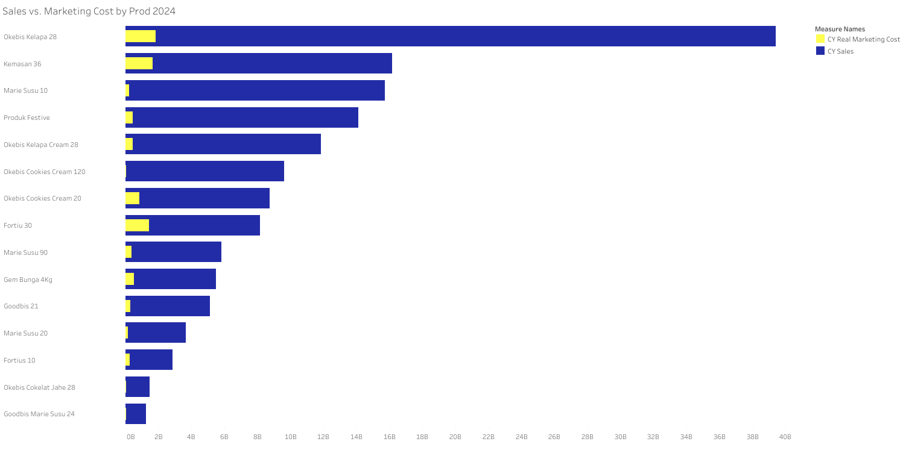
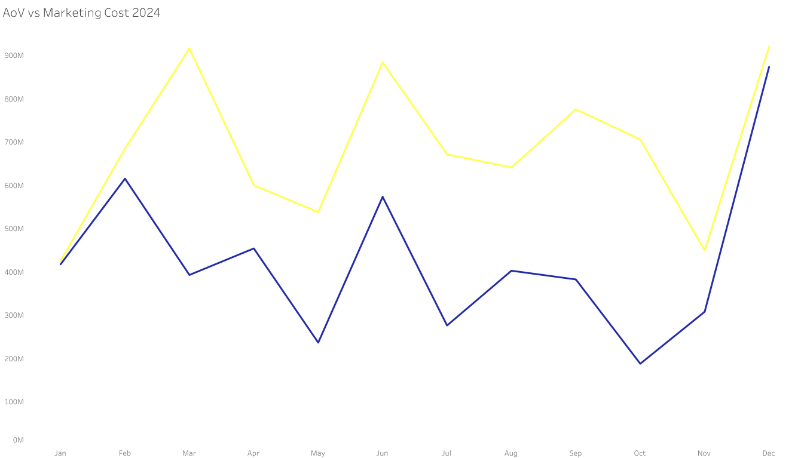

# Data Analyst Portfolio — Inafoods East Java (2024)

📘 **Commercial Performance Analysis — Inafoods East Java (2024)**  
**Prepared for:** CEO, Vice Director of Commerce, GM of Marketing 
**Objective:** To provide insights for improving commercial performance based on sales and marketing data analysis 2024 in East Java

---

## Table of Contents
- [Data Structure Overview](#data-structure-overview)
- [Executive Summary](#executive-summary)
- [Insight Deep Dive](#insight-deep-dive)
  - [A. Sales Performance](#a-sales-performance)
  - [B. Product Performance](#b-product-performance)
  - [C. Region Performance](#c-region-performance)
- [Recommendations](#recommendations)
- [Dashboard](#dashboard)

---

## Data Structure Overview

The data sets used for this analysis were sourced from various systems and departments within Inafoods. Specifically, sales data from distributors and end customers were pulled from different software platforms, while marketing-related data (such as incentives and program claims) was manually recorded using Excel. This discrepancy in data sources resulted in significant format variations.
Furthermore, the lack of a unified coding system across these datasets required the creation of a manual product code. This manual process allowed for more comprehensive data analysis, although it introduced potential inconsistencies and errors. These inconsistencies not only slowed the analysis process but also posed risks to decision-making accuracy if not addressed systematically.
To resolve this, all datasets were eventually consolidated into a single unified dataset, ensuring that the data could be analyzed together for better insight generation. 

  

---

## Executive Summary

- **Sales Performance:** Sales in East Java decreased by 5% in 2024 compared to 2023, despite a decrease in marketing spend of 8%. ROI improved by 25.7%, signaling more efficient marketing efforts.

  

- **Product Performance:** Three product groups (28-BC-004, 10-BC-001, 36-BC-000) contributed 46% of total sales. Fortiu 30 had high marketing spend but poor ROI, while Okebis Cookies Cream 120 showed strong organic demand, with no marketing support.

  

- **Region Performance:** Three regions—Malang, Pamekasan, and Tuban—emerged as top performers, jointly contributing Rp 56 billion, or 36% of total sales.
  

  

## Insight Deep Dive

### A. Sales Performance

- **2024 Overview:** **Total sales in East Java dropped by 5% YoY**, despite an **8% reduction in marketing expenses**. This suggests that **lower marketing investment did not correlate directly to revenue loss, indicating potential inefficiency.**

  

- **ROI Trends:** **ROI improved by 25.7% YoY**, suggesting marketing expenditure generated better returns despite lower sales. This highlights a more efficient use of marketing resources.
- **AOV & Marketing Cost:** Average Order Value (AOV) in 2024 – blue line, was higher than in 2023-grey line, but still fell short of the marketing cost in most months, except for January and December.

  

- **Monthly Variations:**  **March** Sales peaked (+19% MoM). **April** Sharp decline in sales (-43% MoM) despite lower marketing expenses, suggesting missed opportunities. **October** Despite increased marketing spending, AOV dropped, indicating inefficiency in ad spending.

  

### B. Product Performance

- **Top Performance:** Three products (28-BC-004, 10-BC-001, 36-BC-000) contributed 46% of sales (Rp 67.6B), showing a **high concentration of sales in a few products**. This exposes Inafoods to **market dependency risk.**
- **Fortiu 30** had high marketing expenditure but ranked 8th in sales, suggesting poor ROI. Marketing efforts need reallocation.
- **Okebis Cookies Cream 120** performed strongly with zero marketing support, indicating **strong organic demand**. Investing in its promotion could lead to even stronger sales.

  

- **Product Efficiency:**
  **Festive Products:** High AOV but seasonal, meaning they are not available year-round.
  **Regular Products:** Only Marie Susu 90 exceeded marketing cost in terms of AOV, but others like Goodbis Marie Susu 24 and Okebis Cookies Cream 120 had high AOV without any marketing support.
  

  

### C. Region Performance

- **Top Regions:** Malang, Tuban, and Pamekasan contributed **36% of total sales** (Rp 52B), with Malang being the top performer. However, Malang's **high marketing cost per order** signals inefficiencies that need addressing.
- **AOV Efficiency:** Surabaya and Bangkalan showed efficient marketing expenditure**, with a high AOV compared to marketing costs. These regions should receive an additional focus for investment.

 

  

 

  

## Recommendations

**1. Product Strategy**: First, reallocate marketing budget away from **Fortiu 30** and other low-performing products. Focus on **high-potential items** like **Okebis Cookies Cream 120**, which showed strong organic sales despite lack of marketing. Second, strengthen marketing for **Marie Susu 90**, which shows promising AOV despite being available year-round.
   

**2. Region Strategy:** Develop a marketing program that prioritizes investment in regions demonstrating strong cost efficiency—specifically, those with consistently high AOV and relatively low average marketing spend.
Rather than distributing budgets evenly across all areas, focus on regions where marketing has a proven impact on sales performance. This targeted approach not only maximizes return on investment but also minimizes wasted spending in underperforming regions.

**3.Monitoring and Adjustment:** Implement more granular month-on-month tracking to identify underperforming months early (e.g., April’s sales drop of 43%) and adjust campaigns as needed.
 Prioritize investment in regions with strong marketing ROI, such as Surabaya and Bangkalan.

## Dashboard

📊 **[See Full Dashboard Here](Commercial%20Performance%20Graphics.pdf)**

